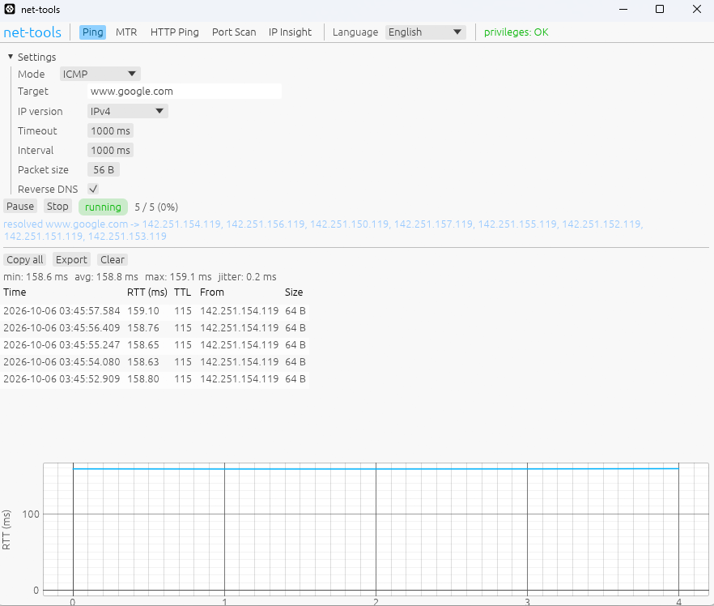
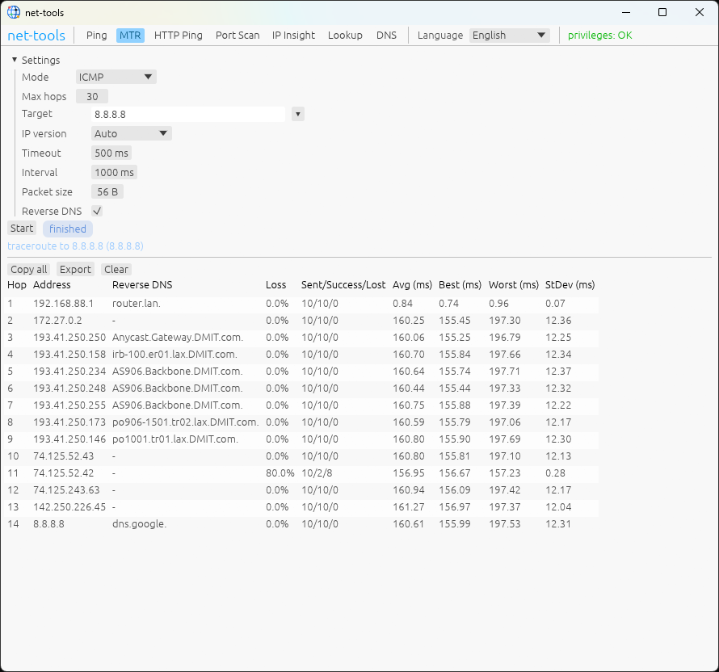
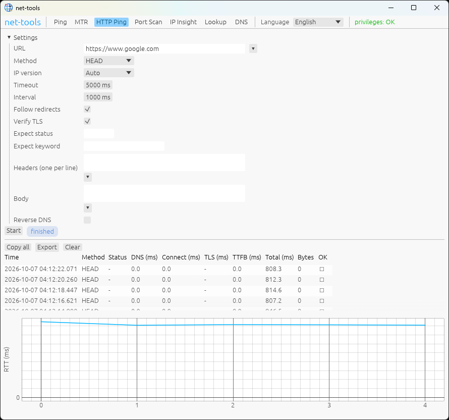
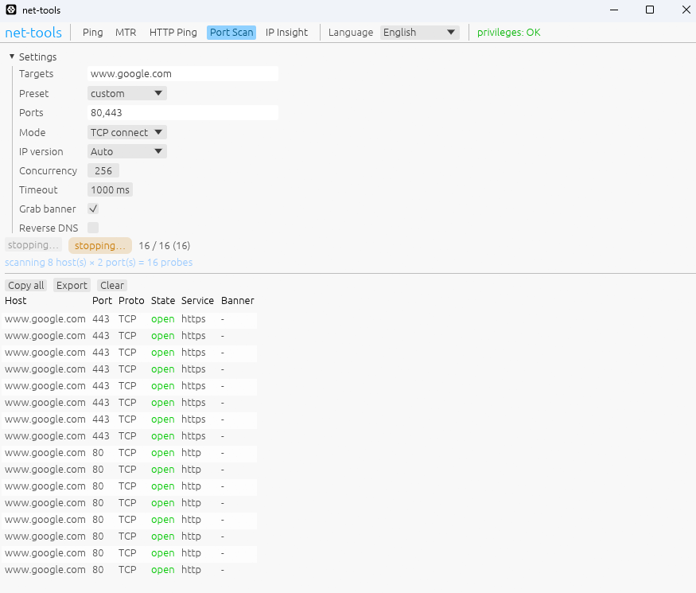
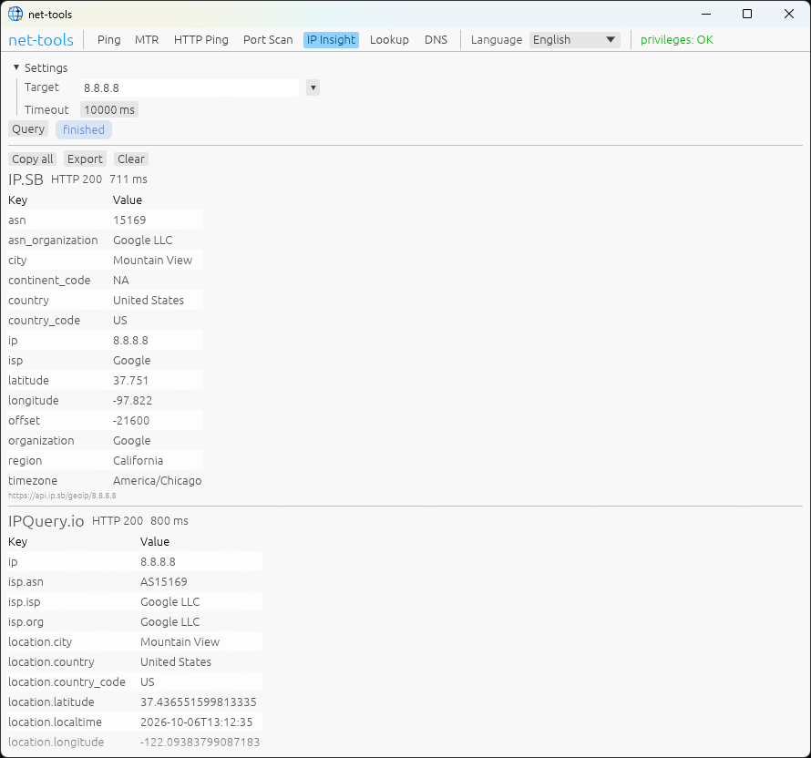
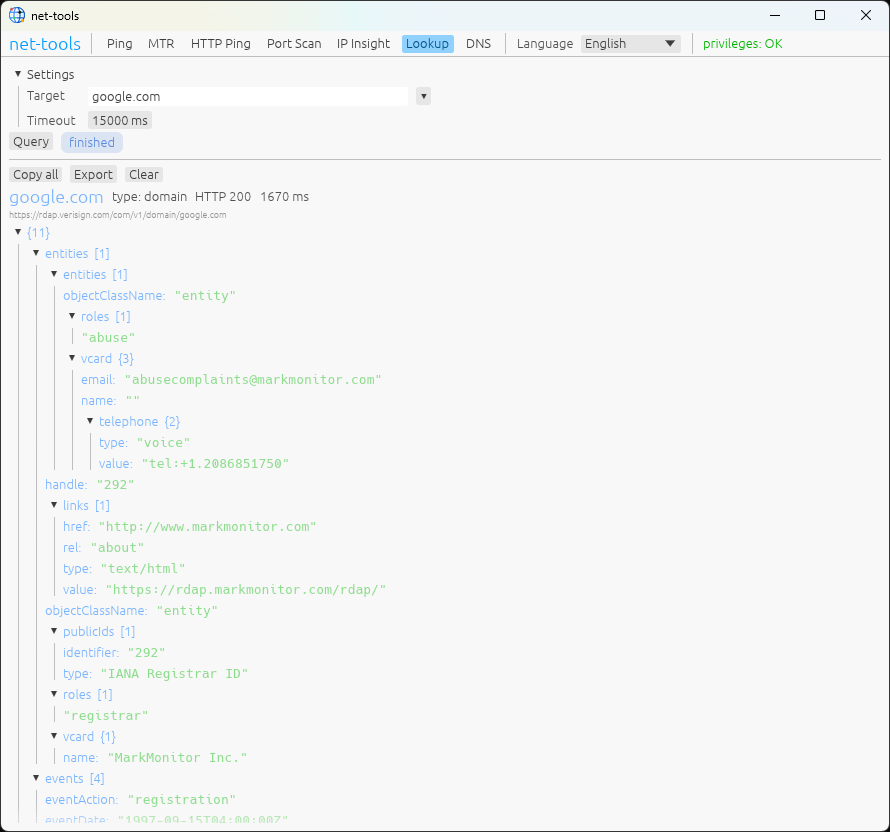
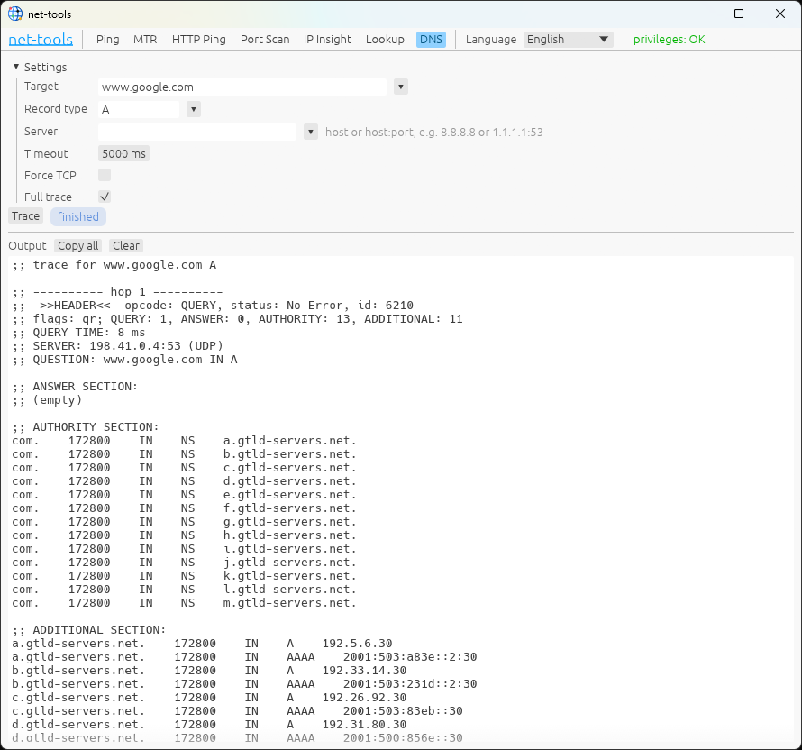

# net-tools

[](LICENSE)

A cross-platform (Windows / macOS / Linux) desktop network diagnostics tool built
with Rust and egui. Each network feature lives in its own tab, and probes in
different tabs run **simultaneously and independently**.

## Features

| Tab | Description | Probe modes |
|-----|-------------|-------------|
| Ping | Continuous probing with a live chart, loss rate and min/avg/max/jitter | ICMP, UDP |
| MTR | Continuous hop-by-hop routing: all hops are probed in parallel and each is refreshed at the probe interval; multiple responders per hop are listed comma separated | ICMP, UDP |
| HTTP Ping | Multi-method requests with per-stage timing (DNS/connect/TLS/TTFB/total) | GET/HEAD/POST/PUT/DELETE/OPTIONS/PATCH |
| Port Scan | TCP connect / SYN half-open / UDP, with banner grabbing | — |
| IP Insight | Query a target IP against several online geolocation APIs at once; each provider's JSON response is shown as its own table | — |
| Lookup | Query a domain or IP address through RDAP; the registration data is shown as a fully expanded JSON tree, with jCard contact data parsed into readable fields and automatic fallback to the parent domain when a subdomain has no record | — |
| DNS | dig-like queries for a chosen record type (optional custom server, UDP with TCP fallback), plus a full iterative trace from the root servers; results are shown as text | — |

### Common settings

- Target (host name or IP address)
- IPv4 / IPv6 / auto resolution
- Timeout
- Probe interval
- Packet size
- PTR reverse lookup (whether to resolve the domain name for an IP)

Every feature provides **Start / Pause / Stop** controls. Pausing stops issuing
new probes while keeping existing results; resuming continues.

Pressing **Enter** in a target input stops the running task and immediately
starts a new one with the edited target.

### Other

- Bilingual UI (English / Chinese), extensible: adding a language is just a new
  YAML file under `locales/`.
- **Bundled CJK font** (WenQuanYi Micro Hei, Apache-2.0), so Chinese and other
  CJK text renders without any system font installation — see `assets/fonts/`.
- Results can be **copied** and **exported** (CSV / JSON / HTML).
- Table columns auto-size to fit the latest content.
- Configuration is saved to the platform config directory and restored on the
  next launch.

## Screenshots

| Ping | MTR |
|------|-----|
|  |  |

| HTTP Ping | Port Scan |
|-----------|-----------|
|  |  |

| IP Insight | Lookup |
|------------|--------|
|  |  |

| DNS |
|-----|
|  |

## Build and run

```bash
# Install Rust (rustup): https://rustup.rs
cargo run --release -p net-tools
```

### Linux runtime dependencies

On Linux, egui (glow backend) needs X11/Wayland and OpenGL client libraries, for
example on Debian/Ubuntu:

```bash
sudo apt-get install -y libxkbcommon0 libxkbcommon-x11-0 libxcursor1 libxi6 \
  libxrandr2 libxfixes3 libxinerama1 libwayland-client0 libgl1 libegl1 xkb-data
```

On WSL2, install the same packages if they are missing. Windows and macOS need no
extra dependencies.

## Privileges (unprivileged, best effort)

The tool tries to run unprivileged. Capabilities that require a raw socket (raw
ICMP, SYN scan, UDP MTR) show a clear message with guidance when unavailable:

| Platform | Available unprivileged | Requires privileges |
|----------|------------------------|---------------------|
| Linux | ICMP ping (ping socket), UDP ping, TCP connect scan | ICMP MTR, SYN scan, UDP MTR |
| macOS | UDP ping, TCP connect scan | ICMP, MTR, SYN |
| Windows | ICMP ping (system API) | SYN scan, UDP MTR |

### Granting privileges

- **Linux**: prefer granting only the raw-socket capability instead of running as
  root:

  ```bash
  sudo setcap cap_net_raw+ep "$(readlink -f "$(which net-tools)")"
  ```

  or simply `sudo ./net-tools`.
- **macOS**: `sudo ./net-tools`.
- **Windows**: right-click and choose "Run as administrator".

The status bar at the top reports both capabilities separately: the badge is
neutral when everything works, warns when probing works but the raw-socket
features do not, and turns red when even ICMP probing cannot open a socket.
Hovering shows which capability is missing, and the `copy cmd` button offers the
matching authorization command. The hint is only shown for real permission
errors, so a DNS or address-family problem never sends you looking for
administrator rights.

## Packaging installers

Using [cargo-packager](https://github.com/crabnebula-dev/cargo-packager):

```bash
cargo install cargo-packager --locked
cargo build --release
# Linux
cargo packager -c packager.toml -f deb,appimage   # needs patchelf squashfs-tools file
# Windows
cargo packager -c packager.toml -f wix,nsis
# macOS
cargo packager -c packager.toml -f app,dmg
```

Artifacts are written to `dist/`.

### Application icon

The single source of truth is `assets/icon.png` (a non-interlaced 8-bit RGBA
PNG). To change the application icon:

```bash
# 1. Replace the master image (must be a non-interlaced 8-bit RGBA PNG).
cp new-icon.png assets/icon.png

# 2. Regenerate the derived Windows icon.
python3 scripts/generate_icons.py   # writes assets/icon.ico from assets/icon.png

# 3. Rebuild and, to refresh installers, repackage.
cargo build --release
cargo packager -c packager.toml -f deb,appimage   # or wix,nsis / app,dmg
```

`assets/icon.ico` is committed, so step 2 only needs to run when the master PNG
changes.

Where the icon is used:

- **Runtime window / taskbar (while running)**: `assets/icon.png`, loaded in
  `crates/app/src/main.rs`.
- **Windows executable / Explorer / NSIS shortcuts**: `assets/icon.ico`, embedded
  by `crates/app/build.rs` (`winresource`).
- **Packaged installers**: `packager.toml` lists `assets/icon.ico` and
  `assets/icon.png`; Linux uses the PNG, macOS derives its `.icns` from the PNG,
  and WiX uses the `.ico` for the desktop shortcut and Add/Remove Programs icon.

## Cross-compilation

Cross-compiling produces the **executable only**. Installers (`.msi`/`.exe`,
`.app`/`.dmg`) still need the target platform's native packaging tools, so
releases are built on the native CI runners (see below). The commands below build
the binary from a Linux host.

### Windows (MSVC, recommended)

[`cargo-xwin`](https://github.com/rust-cross/cargo-xwin) downloads the MSVC CRT
and Windows SDK automatically, so it needs no Windows installation:

```bash
# Debian/Ubuntu (clang-cl + lld and cmake/ninja for C dependencies)
sudo apt-get install -y clang lld llvm cmake ninja-build

rustup target add x86_64-pc-windows-msvc
cargo install cargo-xwin --locked

# First run downloads the MSVC CRT + Windows SDK (~hundreds of MB)
cargo xwin build --release --target x86_64-pc-windows-msvc -p net-tools
# -> target/x86_64-pc-windows-msvc/release/net-tools.exe
```

Useful options: `--xwin-version <15|16|17|18>`, `--xwin-sdk-version <VER>`,
`--xwin-crt-version <VER>`; `cargo xwin env` prints the environment for editors.

### Windows (GNU)

```bash
sudo apt-get install -y mingw-w64
rustup target add x86_64-pc-windows-gnu

cargo build --release --target x86_64-pc-windows-gnu -p net-tools
# -> target/x86_64-pc-windows-gnu/release/net-tools.exe
```

If the linker is not picked up, either add a `.cargo/config.toml`:

```toml
[target.x86_64-pc-windows-gnu]
linker = "x86_64-w64-mingw32-gcc"
ar = "x86_64-w64-mingw32-ar"
```

or pass it per command:

```bash
CARGO_TARGET_X86_64_PC_WINDOWS_GNU_LINKER=x86_64-w64-mingw32-gcc \
CARGO_TARGET_X86_64_PC_WINDOWS_GNU_AR=x86_64-w64-mingw32-ar \
cargo build --release --target x86_64-pc-windows-gnu -p net-tools
```

### macOS

Building for macOS from Linux requires the Apple SDK and
[osxcross](https://github.com/tpoechtrager/osxcross); redistributing the SDK is
restricted by Apple's license, so building on a Mac (or via CI) is usually
simpler:

```bash
rustup target add x86_64-apple-darwin   # or aarch64-apple-darwin
# point the target linker at osxcross' clang wrapper, then:
cargo build --release --target x86_64-apple-darwin -p net-tools
```

### Notes

- The HTTP engine uses `rustls`. Its default `aws-lc-rs` backend is a C library
  and tends to be the hardest part to cross-compile. If it fails, make sure
  `cmake`, `ninja` and a target C compiler are installed, or switch the TLS
  backend to `ring`.
- Only the host platform's installers can be produced locally with
  `cargo packager`; use the native CI runners for other platforms.

## CI and releases

- `.github/workflows/ci.yml`: build, test, clippy (warnings are errors) and format
  checks on ubuntu / windows / macos.
- `.github/workflows/release.yml`: on a `v*` tag, build installers on native
  runners and publish them to a GitHub Release.

## Project layout

```
crates/core    # probing engines and config models (no UI), independently testable
crates/app     # egui desktop application
locales/       # i18n locale files (en / zh-CN, extensible)
assets/        # icons and the bundled font (assets/fonts/)
scripts/       # helper scripts (icon generation)
screenshots/   # UI screenshots used in this README
packager.toml  # cargo-packager configuration
.github/       # CI / release workflows
```

## Testing

```bash
cargo test --workspace
```

The probe engines have loopback-based integration tests (ICMP/UDP ping, MTR,
HTTP, port scanning). SYN scan and UDP MTR require a raw socket, so those tests
are skipped automatically when privileges are missing.

Dependency, license and advisory checks are configured with
[cargo-deny](https://embarkstudios.github.io/cargo-deny/) (`deny.toml`):

```bash
cargo install cargo-deny --locked
cargo deny check
```

## Contributing

Contributions are welcome. Please read [CONTRIBUTING.md](CONTRIBUTING.md) for the
development setup, coding conventions and pull request checklist.

## Author / Contact

- Author: playhard.pro
- Email: rex@playhard.pro
- GitHub: <https://github.com/playhard-pro>
- Repository: <https://github.com/playhard-pro/net-tools>

## Third-party licenses

- **WenQuanYi Micro Hei** (`assets/fonts/wqy-microhei.ttc`) — Apache License 2.0.
  It is dual-licensed "Apache-2.0 OR GPL-3.0-or-later with Font exception"; this
  project redistributes it under Apache-2.0. Attribution is in
  `assets/fonts/LICENSE-wqy-microhei.txt` and the license text in
  `assets/fonts/APACHE-2.0.txt`. Both files are also shipped inside the
  generated installers.

Rust dependencies are licensed under their respective terms (predominantly
MIT / Apache-2.0). A complete, generated list of every dependency and its
license text is in [THIRD_PARTY_LICENSES.md](THIRD_PARTY_LICENSES.md), produced
with [cargo-about](https://github.com/EmbarkStudios/cargo-about).

## License

net-tools is released under the MIT License — see [LICENSE](LICENSE). The
bundled font remains under Apache-2.0 as described above.
